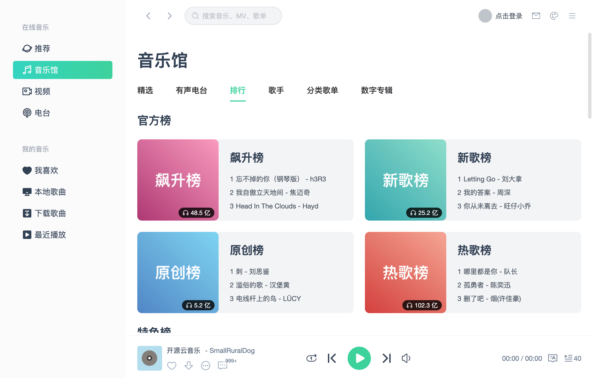
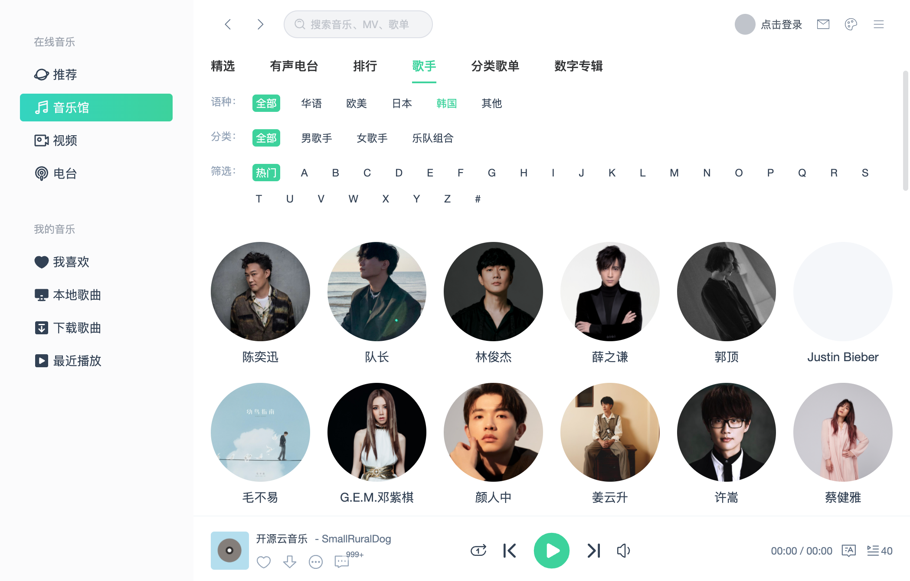
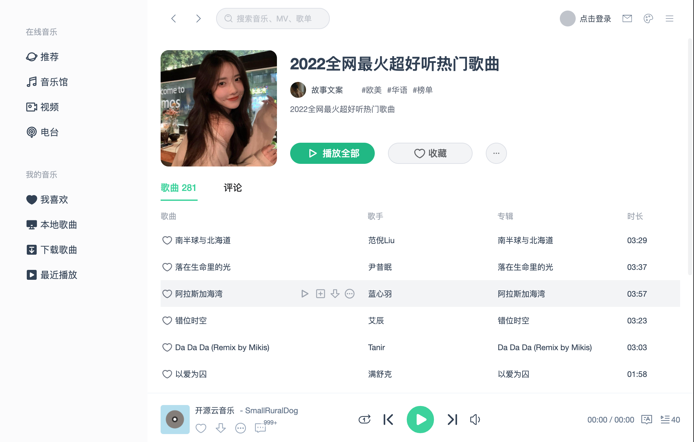
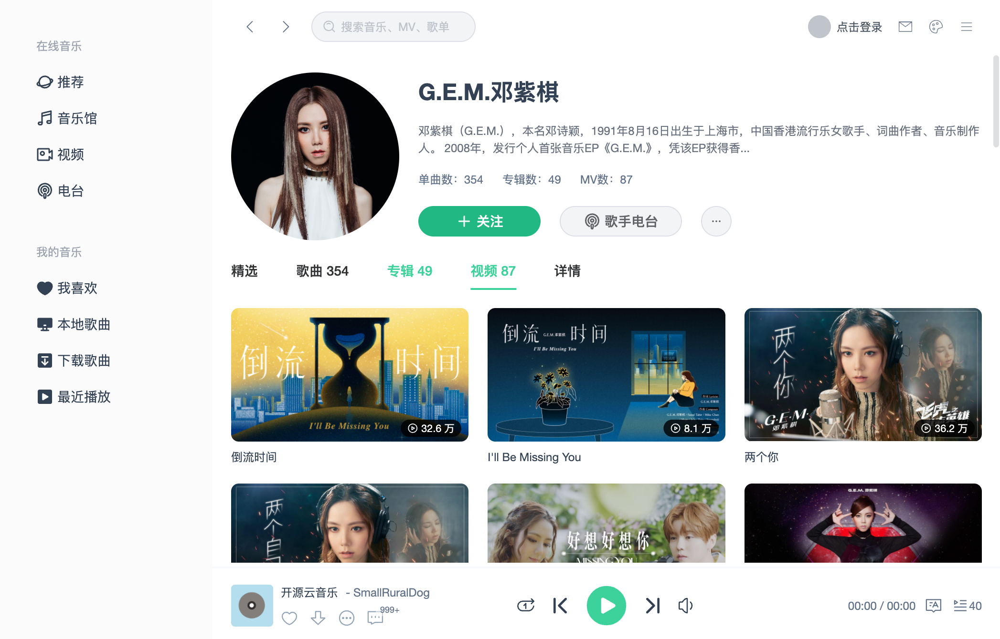

# VUE3-MUSIC

基于 VUE3+TS 开发的音乐播放器，界面模仿QQ音乐。

在线体验：[https://smallruraldog.github.io/vue3-music](https://smallruraldog.github.io/vue3-music)

在线演示为了安全考虑，不提供API接口服务，需要准备好自己的API服务地址，并且是HTTPS的，没有HTTPS的服务，可以本地运行，首次打开时会要求设置API地址


## 本地安装

```
git clone https://github.com/SmallRuralDog/vue3-music.git
cd vue3-music
yarn
yarn run dev
```

## 网易云音乐API

需要运行API服务才能正常体验

[开发文档](https://binaryify.github.io/NeteaseCloudMusicApi)

## 开发进度

当前开发正在进行中，只有少数页面可使用

- [x] 播放、暂停、音量设置等基础播放控制
- [x] 精选
- [ ] 音乐馆
  - [x] 精选
  - [ ] 有声电台
  - [x] 排行
  - [x] 歌手
  - [ ] 分类歌单
  - [ ] 数字专辑
- [ ] 视频
- [ ] 电台
- [x] 歌单详情页
- [x] 歌手详情页
- [ ] 还有很多很多页面

## UI










## PS

通过此开源项目学习VUE3的强大..加油！
